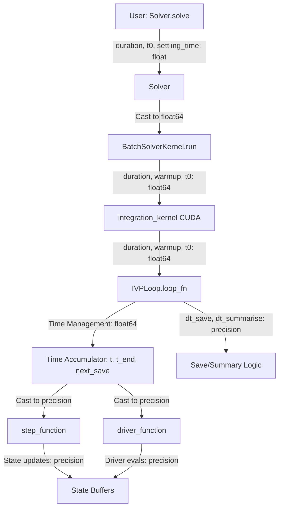

# Time Precision Fix - Human Overview

## User Stories

### Story 1: Float32 Integration with Small Time Steps
**As a** CuBIE user running integrations with `precision=float32`  
**I want** to use very small minimum time steps (`dt_min < 1e-7`)  
**So that** adaptive step controllers can handle stiff systems without hanging

**Acceptance Criteria:**
- Integrations with `precision=float32` and `dt_min=1e-8` complete successfully
- Accumulated time `t` continues to increase even after many small time steps
- Time comparisons for save points and end time work correctly
- No precision loss in accumulated time causes infinite loops or hangs

### Story 2: High-Precision Time Accumulation
**As a** CuBIE developer  
**I want** time parameters to use float64 precision internally  
**So that** time accumulation is accurate regardless of user-specified state precision

**Acceptance Criteria:**
- Time variables (`t`, `t_end`, `next_save`, `t0`, `duration`, `settling_time`) use float64
- Time comparisons use float64 precision
- Changes are transparent to users (no API changes)
- Backward compatibility maintained for existing code

### Story 3: Precision Separation at Boundary
**As a** CuBIE developer  
**I want** a clear separation between time management (float64) and state calculations (user precision)  
**So that** the codebase maintains proper precision semantics throughout

**Acceptance Criteria:**
- IVPLoop manages time in float64, passes dt and t to step functions in user precision
- Step functions receive time values cast to user-specified precision
- No float64 values leak into state/gradient calculations
- dt_save and dt_summarise remain in user precision (they're intervals, not accumulations)

## Executive Summary

This fix addresses a critical floating-point precision bug where float32 integrations fail when using very small time steps (`dt_min < ~1e-7`). The root cause is that accumulated time `t` loses precision when stored as float32, eventually reaching a point where adding small dt values no longer changes `t`, causing infinite loops.

**Solution:** Separate time management (which needs float64) from state calculations (which use user-specified precision). Time parameters flow through the system in float64 until they reach the IVPLoop boundary, where dt and t are cast to user precision before passing to step functions.

## High-Level Architecture



## Data Flow Diagram

```mermaid
sequenceDiagram
    participant User
    participant Solver
    participant Kernel as BatchSolverKernel
    participant IntKernel as integration_kernel
    participant Loop as IVPLoop
    participant Step as step_function
    
    User->>Solver: solve(duration, t0, settling_time)
    Note over Solver: Store as _duration, _t0, _warmup
    Solver->>Kernel: run(duration, warmup, t0)
    Note over Kernel: Cast to float64
    Kernel->>IntKernel: duration, warmup, t0 (float64)
    IntKernel->>Loop: duration, settling_time, t0 (float64)
    Note over Loop: t = float64(t0)<br/>t_end = float64(settling_time + duration)<br/>next_save = float64(...)
    Loop->>Loop: t_proposal = t + dt_eff (float64)
    Loop->>Step: dt_eff, t (cast to precision)
    Note over Step: All calculations in user precision
    Step-->>Loop: status code
    Loop->>Loop: t = selp(accept, t_proposal, t) (float64)
```

## Key Technical Decisions

### Decision 1: Time Parameters as Float64
**Rationale:** Time is accumulated over many small steps. Float32 precision (~7 decimal digits) is insufficient for accumulated time when dt_min is 1e-7 or smaller. Using float64 (~15 decimal digits) ensures time accumulation remains accurate.

**Impact:** 
- Changes to Solver, BatchSolverKernel, IVPLoop internal time representation
- No user-facing API changes
- Slightly increased memory for time scalars (negligible)

### Decision 2: Precision Boundary at IVPLoop
**Rationale:** The IVPLoop is the natural boundary between time management and numerical integration. It controls the integration progress and delegates actual state updates to step functions.

**Impact:**
- IVPLoop manages time in float64
- Step functions receive dt and t cast to user precision
- Clean separation of concerns

### Decision 3: Keep dt_save and dt_summarise in User Precision
**Rationale:** These are interval specifications, not accumulated values. They don't suffer from cumulative precision loss. Keeping them in user precision maintains consistency with the rest of the output configuration.

**Impact:**
- No changes to output handling code
- dt_save additions to next_save happen in float64 (next_save is float64)

## Trade-offs and Alternatives Considered

### Alternative 1: Use float64 for Everything
**Rejected:** This would eliminate the user's choice of precision for state calculations. The performance benefit of float32 for state vectors (especially on memory-constrained GPUs) is significant.

### Alternative 2: Adaptive Epsilon Based on Precision
**Rejected:** This treats the symptom, not the cause. Time accumulation would still lose precision, just with a larger tolerance. The fundamental issue is that float32 cannot accurately represent accumulated time with very small steps.

### Alternative 3: Time Scaling/Normalization
**Rejected:** Would require user awareness and code changes. Users would need to rescale their systems, which is error-prone and breaks existing workflows.

## Expected Impact on Architecture

### Files Modified
1. **solver.py**: Time parameter storage changes from `self.precision()` to always float64
2. **BatchSolverKernel.py**: 
   - Time parameter handling in `run()` and `chunk_run()`
   - CUDA kernel signature uses float64 for time parameters
3. **ode_loop.py**: 
   - Internal time variables (t, t_end, next_save) use float64
   - dt and t cast to precision when passed to step functions
   - Loop function signature accepts float64 time parameters

### Backward Compatibility
- **Maintained**: User-facing API unchanged
- **Maintained**: Step function signatures unchanged (receive precision-typed parameters)
- **Maintained**: All tests should pass without modification (logic unchanged, only internal precision)

## References to Research

- NumPy float32 epsilon: ~1.2e-7
- NumPy float64 epsilon: ~2.2e-16
- Time accumulation over 1e6 steps of dt=1e-8: requires ~8 significant digits
- Float32 provides ~7 significant digits → insufficient
- Float64 provides ~15 significant digits → sufficient

## Validation Strategy

1. **Unit Tests**: Verify float64 time accumulation doesn't lose precision over many small steps
2. **Integration Tests**: Run float32 integration with dt_min=1e-8, verify completion
3. **Regression Tests**: Ensure existing tests pass without modification
4. **Edge Case Tests**: Test very long integrations (large t0 + long duration) with small dt_min
