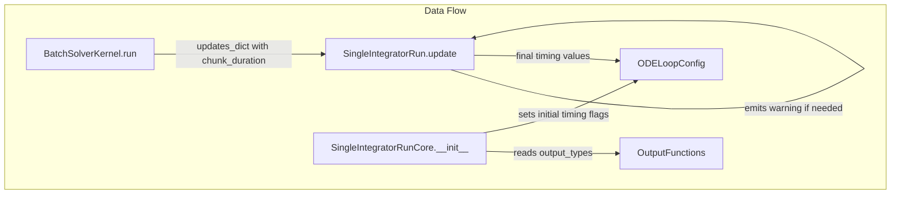

# Timing Control Logic Implementation - Human Overview

## User Stories

### US-1: Automatic Timing Flag Detection
**As a** CuBIE user  
**I want** the integrator to automatically detect when I've requested time-domain or summary outputs but haven't specified explicit timing  
**So that** my outputs work correctly without requiring me to understand internal timing parameters

**Acceptance Criteria:**
- [ ] When `save_every == None` but "state", "observables", or "time" in output_types → `save_last=True`, `output_length=2`
- [ ] When `summarise_every == None` and `sample_summaries_every == None` but summary metrics in output_types → `summarise_last=True`, `samples_per_summary` defaults to `duration/100`, `output_summaries_length=2`
- [ ] SingleIntegratorRunCore.__init__ sets timing flags based on output_types

### US-2: Automatic Sample Interval Inference
**As a** CuBIE user  
**I want** sample_summaries_every to be automatically calculated when I specify summarise_every  
**So that** I don't need to specify redundant timing parameters

**Acceptance Criteria:**
- [ ] When `summarise_every` is specified but `sample_summaries_every` is None → `sample_summaries_every` defaults to `summarise_every / 10`
- [ ] This inference happens in SingleIntegratorRunCore

### US-3: Duration-Based Warning
**As a** CuBIE user  
**I want** to receive a warning when timing depends on duration  
**So that** I understand potential recompilation implications when changing duration

**Acceptance Criteria:**
- [ ] Warning emitted by SingleIntegratorRun when sample_summaries_every is computed from chunk_duration
- [ ] Warning explains kernel recompilation impact
- [ ] Warning suggests explicit parameter setting

### US-4: Chunk Duration Interception
**As a** developer maintaining CuBIE  
**I want** SingleIntegratorRun to intercept chunk_duration from BatchSolverKernel  
**So that** duration-dependent timing calculations happen at the appropriate layer

**Acceptance Criteria:**
- [ ] BatchSolverKernel passes chunk_duration in updates_dict
- [ ] SingleIntegratorRun.update intercepts chunk_duration
- [ ] Duration is NOT passed below SingleIntegratorRun (not to loops)

---

## Executive Summary

This implementation adds the actual timing control logic to SingleIntegratorRunCore. The architectural foundation (properties, methods, simplified ODELoopConfig) is already in place from previous work. This task implements:

1. **Timing flag initialization** in `__init__` based on output_types
2. **Timing consolidation** in `update` that intercepts chunk_duration and computes sample_summaries_every
3. **Warning emission** for duration-dependent timing
4. **BatchSolverKernel updates** to pass chunk_duration

---

## Architecture Overview



---

## Timing Logic Decision Tree

```mermaid
flowchart TD
    START[Start timing consolidation]
    
    subgraph "Time Domain Outputs"
        CHECK_SAVE[save_every == None?]
        CHECK_TD[Time domain outputs requested?]
        SET_SL[save_last = True<br/>output_length = 2]
        CALC_OL[output_length = floor(duration/save_every) + 1]
    end
    
    subgraph "Summary Outputs"
        CHECK_SUMM[summarise_every == None?]
        CHECK_SS[sample_summaries_every == None?]
        CHECK_SMOUT[Summary outputs requested?]
        SET_SUML[summarise_last = True]
        CALC_SSPE[sample_summaries_every = chunk_duration/100]
        INFER_SSPE[sample_summaries_every = summarise_every/10]
        EMIT_WARN[Emit warning about<br/>duration dependency]
    end
    
    START --> CHECK_SAVE
    CHECK_SAVE -->|Yes| CHECK_TD
    CHECK_SAVE -->|No| CALC_OL
    CHECK_TD -->|Yes| SET_SL
    CHECK_TD -->|No| CALC_OL
    
    SET_SL --> CHECK_SUMM
    CALC_OL --> CHECK_SUMM
    
    CHECK_SUMM -->|Yes| CHECK_SS
    CHECK_SUMM -->|No| CHECK_SS
    CHECK_SS -->|Yes & summarise_every != None| INFER_SSPE
    CHECK_SS -->|Yes & summarise_every == None| CHECK_SMOUT
    CHECK_SS -->|No| END
    CHECK_SMOUT -->|Yes| SET_SUML
    CHECK_SMOUT -->|No| END
    SET_SUML --> CALC_SSPE
    CALC_SSPE --> EMIT_WARN
    INFER_SSPE --> END
    EMIT_WARN --> END
    END[End]
```

---

## Key Implementation Details

### 1. SingleIntegratorRunCore.__init__ Changes

During initialization, after OutputFunctions is created:
- Check output_types for time-domain types ("state", "observables", "time")
- Check output_types for summary metrics (anything not in time-domain types)
- Set initial `save_last` and `summarise_last` flags if timing parameters are None but outputs requested

### 2. SingleIntegratorRunCore.update Changes

When update is called with chunk_duration:
- Intercept chunk_duration (don't pass to loop)
- If summarise_last is True and sample_summaries_every is None:
  - Calculate sample_summaries_every = chunk_duration / 100
  - Emit warning (once per session)
  - Pass computed value to loop

### 3. Warning Logic

```python
warnings.warn(
    "Summary metrics were requested with no summarise_every or "
    "sample_summaries_every timing. Sample_summaries_every was set to "
    "duration / 100 by default. If duration changes, the kernel will need "
    "to recompile, which will cause a slow integration (once). Set timing "
    "parameters explicitly to avoid this.",
    UserWarning,
    stacklevel=3  # Points to user's solve() call
)
```

### 4. BatchSolverKernel Changes

In `run()` method, pass chunk_duration to single_integrator.update():
```python
self.single_integrator.update({
    "chunk_duration": chunk_params.duration,
    ...
})
```

---

## Files to Modify

| File | Changes |
|------|---------|
| `src/cubie/integrators/SingleIntegratorRunCore.py` | Add timing flag detection in `__init__`, timing consolidation in `update` |
| `src/cubie/integrators/SingleIntegratorRun.py` | Add warning emission logic |
| `src/cubie/batchsolving/BatchSolverKernel.py` | Pass chunk_duration in updates_dict |

---

## Trade-offs Considered

| Option | Pros | Cons | Decision |
|--------|------|------|----------|
| Handle timing entirely in ODELoopConfig | Keeps logic together | Config shouldn't depend on duration | **Rejected** |
| Pass duration to lower layers | Simpler data flow | Violates layer boundaries | **Rejected** |
| SingleIntegratorRun intercepts and computes | Clean separation of concerns; appropriate layer | Slightly more complex update() | **Selected** |

---

## Research References

- Current SingleIntegratorRunCore: Handles algorithm, controller, loop coordination
- Current BatchSolverKernel.run(): Already calls single_integrator.update()
- Previous task list: Shows properties/methods already added
- ODELoopConfig: Simplified to passive storage, accepts timing values
