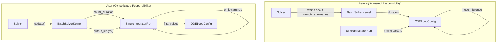
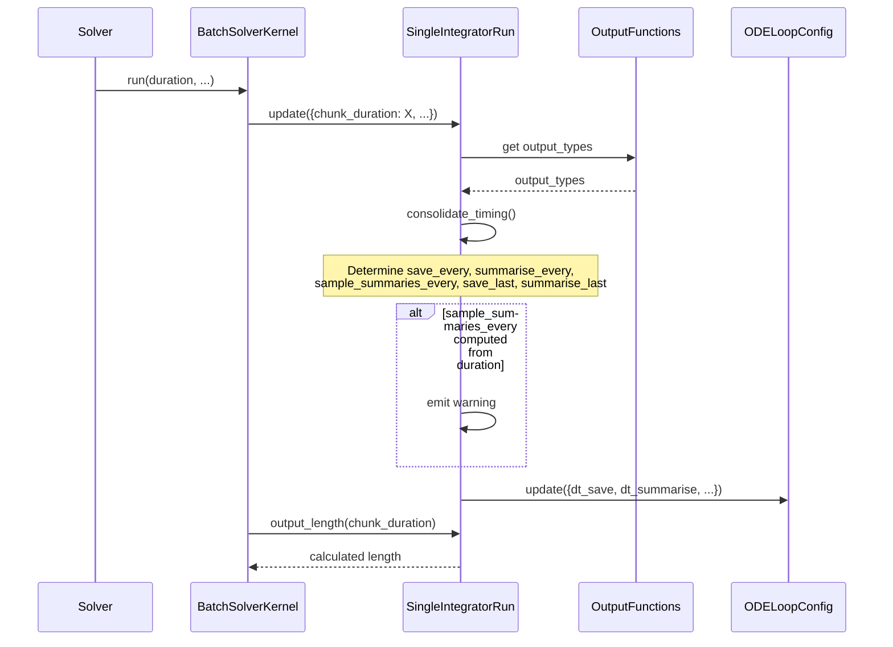

# Timing Responsibility Refactor - Human Overview

## User Stories

### US-1: Centralized Timing Configuration
**As a** CuBIE developer  
**I want** timing parameter responsibility (save_every, summarise_every, sample_summaries_every, save_last, summarise_last) to be consolidated in SingleIntegratorRun  
**So that** the timing logic has a single source of truth that simplifies maintenance and debugging

**Acceptance Criteria:**
- [ ] SingleIntegratorRun receives timing parameters through updates_dict
- [ ] SingleIntegratorRun consolidates information from output_functions, updates_dict, and existing settings
- [ ] Timing values are computed in SingleIntegratorRun and passed to lower components

### US-2: Passive Loop Configuration
**As a** CuBIE developer  
**I want** ODELoopConfig to passively accept and return timing values without mode-setting logic  
**So that** the configuration object remains a simple data container with clear responsibilities

**Acceptance Criteria:**
- [ ] ODELoopConfig no longer contains mode-inference logic (remove reset_timing_inference, save_last/summarise_last inference)
- [ ] Duration is NOT stored in ODELoopConfig (remove _duration attribute)
- [ ] ODELoopConfig accepts timing values and returns them unchanged (with precision casting)

### US-3: BatchSolverKernel Output Length Delegation
**As a** CuBIE developer  
**I want** BatchSolverKernel.output_length to delegate to SingleIntegratorRun  
**So that** output sizing logic is consistent and reuses the centralized timing source

**Acceptance Criteria:**
- [ ] SingleIntegratorRun has `output_length(duration)` method
- [ ] SingleIntegratorRun has `any_time_domain_outputs` property
- [ ] BatchSolverKernel.output_length calls `self.single_integrator.output_length(self.chunk_duration)`
- [ ] Similar pattern for summaries_length

### US-4: Duration-Based Sample Calculation Warning
**As a** solver user  
**I want** to receive a clear warning when sample_summaries_every is computed from duration  
**So that** I understand the recompilation implications of changing duration

**Acceptance Criteria:**
- [ ] Warning is emitted by SingleIntegratorRun (not Solver) when sample_summaries_every is auto-calculated
- [ ] Warning message explains potential kernel recompilation
- [ ] Warning suggests setting timing parameters explicitly

### US-5: Clean Test Structure
**As a** CuBIE developer  
**I want** tests to use fixtures rather than manual construction  
**So that** the test suite follows project conventions and remains maintainable

**Acceptance Criteria:**
- [ ] Delete test files that use manual solver construction
- [ ] Consolidate valid tests into existing test files
- [ ] Tests use and override fixtures per project convention

---

## Executive Summary

This refactor consolidates timing parameter responsibility from scattered locations (ODELoopConfig, Solver, BatchSolverKernel) into **SingleIntegratorRun**, creating a clear ownership model:

1. **SingleIntegratorRun** becomes the timing authority - it receives timing requests, consolidates them with output_functions configuration, and computes final values
2. **ODELoopConfig** becomes a passive data container - stores and returns what it's given
3. **BatchSolverKernel** delegates sizing calculations to SingleIntegratorRun
4. **Solver** no longer handles timing warnings - SingleIntegratorRun does

---

## Architecture Overview

---

## Data Flow: Timing Parameter Resolution

---

## Key Technical Decisions

### 1. Timing Consolidation Location
**Decision**: SingleIntegratorRun  
**Rationale**: SingleIntegratorRun already coordinates algorithm, controller, loop, and output_functions. Adding timing consolidation fits naturally as it needs information from output_functions (output_types) and produces values consumed by the loop.

### 2. Duration Handling
**Decision**: Duration is NOT stored below BatchSolverKernel  
**Rationale**: Duration is a run-time parameter that can change between integrations. It should flow as a method argument (e.g., `output_length(duration)`) rather than being stored in compile settings. This prevents unnecessary cache invalidation.

### 3. Warning Responsibility
**Decision**: SingleIntegratorRun emits warnings about duration-dependent timing  
**Rationale**: SingleIntegratorRun is where the consolidation logic lives and where the auto-calculation decision is made. The warning should come from the same place as the logic.

### 4. save_last / summarise_last Inference
**Decision**: SingleIntegratorRun sets these based on output_types and timing parameters  
**Rationale**: The logic "set save_last if save_every is None AND one of [state, observables, time] is in output_types" requires knowledge of both timing parameters and output configuration - both available in SingleIntegratorRun.

---

## Files to Modify

| File | Changes |
|------|---------|
| `src/cubie/integrators/SingleIntegratorRun.py` | Add timing consolidation logic, output_length method, any_time_domain_outputs property, warning emission |
| `src/cubie/integrators/SingleIntegratorRunCore.py` | Update `update()` to intercept chunk_duration, call timing consolidation |
| `src/cubie/integrators/loops/ode_loop_config.py` | Remove mode-setting logic, _duration, reset_timing_inference; simplify to passive storage |
| `src/cubie/integrators/loops/ode_loop.py` | Update to use simplified config |
| `src/cubie/batchsolving/BatchSolverKernel.py` | Delegate output_length/summaries_length to SingleIntegratorRun |
| `src/cubie/batchsolving/solver.py` | Remove warning logic |

---

## Files to Delete

| File | Reason |
|------|--------|
| `tests/batchsolving/test_duration_propagation.py` | Tests duration storage in ODELoopConfig which is being removed |
| `tests/batchsolving/test_kernel_output_lengths.py` | Most tests invalid; small Nones test to move to existing file |
| `tests/batchsolving/test_solver_timing_properties.py` | Consolidate into existing test file |
| `tests/batchsolving/test_solver_warnings.py` | Warning tests must use fixtures; move to SingleIntegratorRun tests |
| `tests/batchsolving/test_timing_modes.py` | Manual construction tests violate fixture convention |
| `tests/integrators/loops/test_ode_loop_config_timing.py` | Tests mode-inference logic that is being removed |

---

## Impact Assessment

### Breaking Changes
- **ODELoopConfig**: `_duration`, `duration`, `reset_timing_inference()`, `save_last`, `summarise_last` properties removed or changed
- **BatchSolverKernel**: `output_length`, `summaries_length` become delegation calls
- **Solver**: Warning behavior moves to SingleIntegratorRun

### Preservation
- All public API timing parameters (`save_every`, `summarise_every`, etc.) continue to work
- Integration behavior unchanged - only internal responsibility shifts
- Existing solver.solve() API unchanged

---

## Trade-offs Considered

| Option | Pros | Cons | Decision |
|--------|------|------|----------|
| Keep timing logic in ODELoopConfig | Minimal code changes | Violates single responsibility; requires duration propagation | **Rejected** |
| Move timing to BatchSolverKernel | Kernel already has duration | Kernel shouldn't know about output_types | **Rejected** |
| Consolidate in SingleIntegratorRun | Natural coordination point; access to all required info | Some new methods/properties needed | **Selected** |

---

## Research References

- Current ODELoopConfig timing inference: `ode_loop_config.py` lines 1-276 (extensive mode logic)
- Current BatchSolverKernel output_length: `BatchSolverKernel.py` lines 640-660
- Current warning in Solver: Not yet implemented (per issue context)
- Fixture patterns: `tests/conftest.py` extensively documents the override pattern
