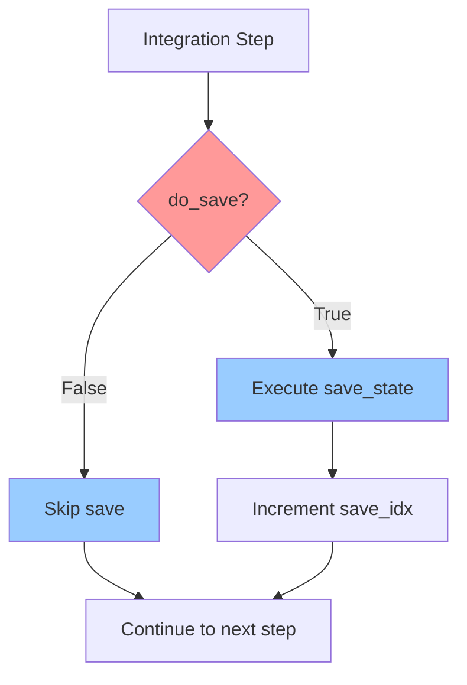
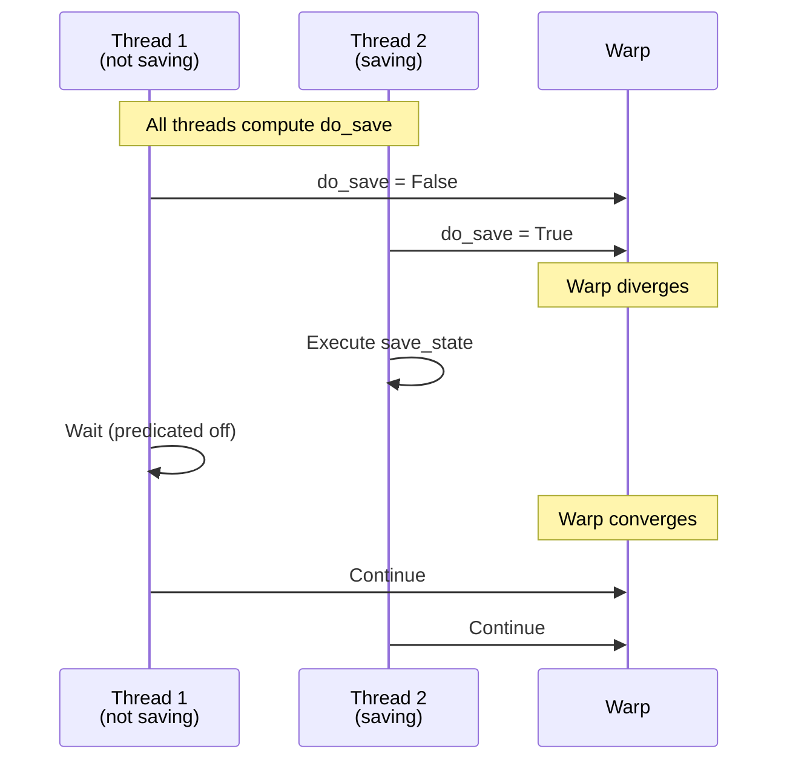
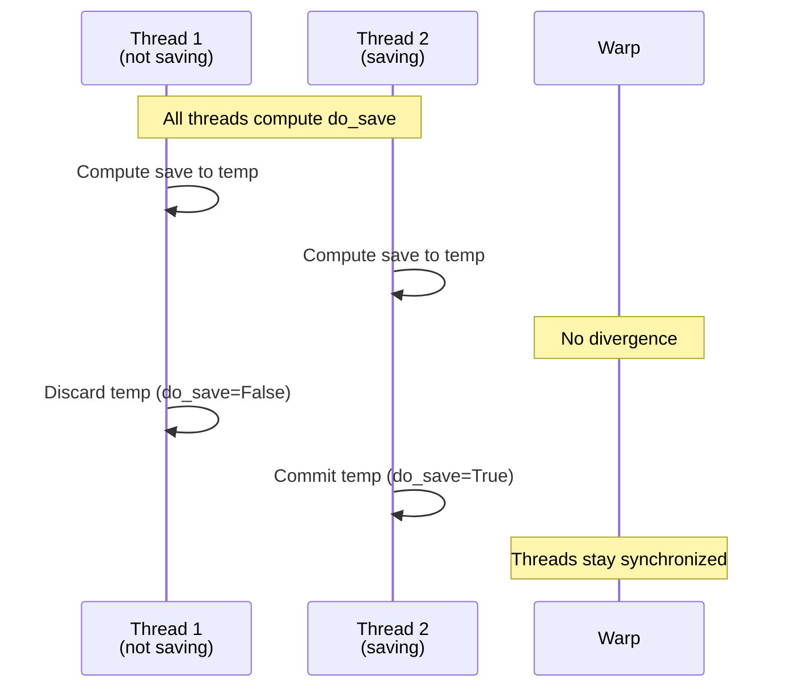
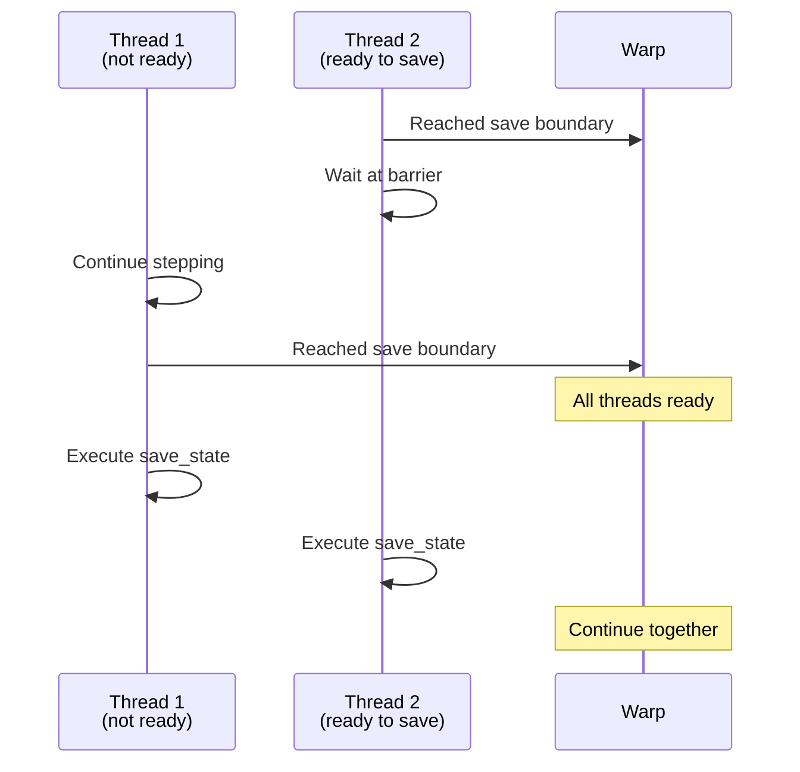
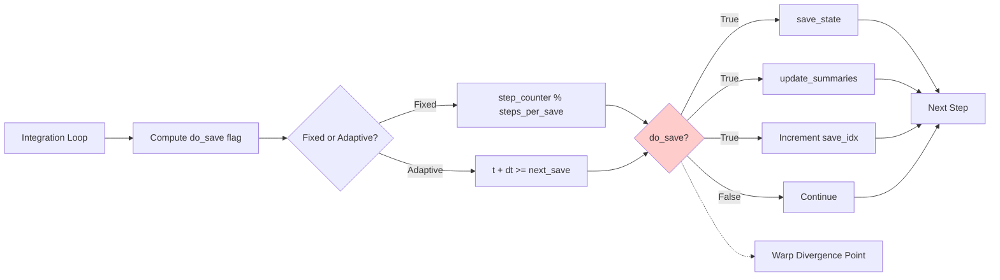

# Human Overview: Warp Divergence at Step-Save Investigation

## Executive Summary

This plan addresses issue #181 concerning potential warp divergence in the save logic of CuBIE's integration loop. The issue involves analyzing whether the current branching approach to saving state is optimal, or if alternative CUDA-friendly implementations (predicated commit or warp synchronization) would improve performance.

**Key Finding**: Based on the repository owner's analysis, the current implementation may already be optimal for typical workloads. This plan focuses on **investigation and documentation** rather than immediate code changes, with optional benchmarking to validate assumptions.

**Recommendation**: Document the architectural decision with analysis of trade-offs, potentially with minimal benchmarking code to support the decision.

## User Stories Overview

Three key stakeholders are identified:
1. **CuBIE Maintainer**: Needs to make an evidence-based architectural decision
2. **Performance-Conscious Developer**: Wants to understand if this affects their workload
3. **Scientific Researcher**: Needs maximum performance for large-scale simulations

Acceptance criteria focus on analysis, documentation, and decision-making rather than implementation.

## Architecture Analysis

### Current Implementation



**Location**: `src/cubie/integrators/loops/ode_loop.py` lines 454-483

**Warp Divergence Point**: The `if do_save:` branch (line 454) causes threads in the same warp to take different code paths when some have reached a save boundary and others haven't.

### Three Implementation Approaches

#### Approach 1: Current Branching (Status Quo)



**Pros**:
- Simple, clear code
- Threads rejoin quickly after save
- No extra computation on non-saving threads

**Cons**:
- Warp divergence (but infrequent for typical workloads)
- Some threads idle during save operations

#### Approach 2: Predicated Commit



**Pros**:
- No warp divergence
- Threads stay synchronized

**Cons**:
- **Wasteful**: All threads compute save operations even when not saving
- Higher computational overhead (1 save computation per step vs 1 per N steps)
- Memory pressure from temporary buffers

#### Approach 3: Warp Sync with Voting



**Pros**:
- Potential for coordinated optimization
- Could enable collective memory operations

**Cons**:
- **Fast threads wait for slow threads**: Lost efficiency
- Already-saved threads can't proceed to next step
- Complex implementation with barrier synchronization
- May not provide benefit if save operations are fast

### Performance Characteristics Analysis

#### Typical Workload Scenario
- **Steps between saves**: 100-1000+ (large N)
- **Threads per warp**: 32
- **Save frequency**: Infrequent relative to total steps

**Current Approach Analysis** (from issue comment):
> "If each thread were to hit do_save at a different time, then there would be 32 runs of save functions per warp per step, with 31 threads predicated off at each point."

This worst-case is unlikely because:
1. Threads in a warp typically have similar convergence rates
2. For fixed-step mode, all threads hit save at the same time
3. For adaptive mode with moderate divergence, only a few threads per warp diverge at save points

**Best Case**: Fixed-step mode - all threads save simultaneously, no divergence

**Moderate Case**: Adaptive mode with similar convergence - small number of divergent saves

**Worst Case**: Adaptive mode with highly divergent convergence across batch - maximum divergence

#### Predicated Commit Analysis
Cost: 1 save computation per step × total steps = **N save computations** (where N is total steps)

Benefit: Eliminates warp divergence at save points

Trade-off: For workloads with saves every 100 steps, this is **100× more save computations** than necessary.

**Conclusion**: Only beneficial if save operations are extremely cheap AND warp divergence is extremely costly. Unlikely for CuBIE workloads.

#### Warp Sync Analysis
Cost: Fast threads wait at save boundaries for slow threads

Benefit: Coordinated save operations, potential for optimizations

Trade-off: Loses the ability for fast threads to proceed to next integration step while slow threads finish current step.

**Conclusion**: Counter to CuBIE's design philosophy of maximizing throughput. Threads that have saved should continue stepping, not wait.

## Technical Decisions and Rationale

### Recommended Approach: Keep Current Implementation

**Rationale**:
1. **Infrequent divergence**: For typical workloads, saves occur every N steps where N >> 32 (warp size)
2. **Fast rejoin**: Save operations are relatively quick, threads rejoin warp immediately
3. **Alternatives are worse**:
   - Predicated commit: Wasteful, increases computational cost by factor of steps-per-save
   - Warp sync: Reduces throughput by forcing fast threads to wait
4. **CUDA handles it well**: Modern CUDA schedulers are designed to handle occasional divergence efficiently

**When Current Approach Might Not Be Optimal**:
- Very high save frequency (dt_save ≈ dt0): Many saves per integration
- Extremely expensive save operations: Multi-millisecond save latency
- Pathological divergence: Every thread in warp saves at different time

These scenarios are unlikely in CuBIE's target use cases (likelihood-free inference, large batch simulations with moderate save frequencies).

### Documentation Approach

Rather than implementing changes, we should:
1. **Document the analysis** in code comments and/or architecture docs
2. **Add inline comments** explaining why branching is used despite divergence
3. **Create optional benchmark** (if requested) to validate assumptions
4. **Record architectural decision** for future reference

## Data Flow Diagram



## Alternative Considered: Hybrid Approach

**Concept**: Use warp voting to detect when most threads are ready to save, then execute save for all threads in warp (predicated commit for that warp only).

```python
# Pseudo-code
mask = activemask()
warp_save_ready = all_sync(mask, do_save)  # Check if all threads ready
if warp_save_ready:
    # All threads save together
    save_state(...)
elif do_save:
    # Only this thread saves (current approach)
    save_state(...)
```

**Pros**: Best of both worlds when threads are synchronized
**Cons**: Added complexity, minimal benefit over current approach

**Decision**: Not worth the complexity for marginal gains.

## Impact on Existing Architecture

### No Code Changes Required (Recommended Path)
- Add documentation comments to `ode_loop.py` explaining the save divergence decision
- Update architecture documentation (`cubie_internal_structure.md`) with warp divergence analysis
- Optionally add benchmark script to validate assumptions

### If Benchmarking Requested
- Create simple benchmark comparing save frequencies and divergence patterns
- Measure actual wall-clock time impact of save operations
- Validate that current approach is optimal for target workloads

## References to Research Findings

1. **Issue #181**: Original bug report about warp divergence at save
2. **Issue #149**: Related issue about FSAL caching causing divergence
3. **Issue #117**: Warp syncing strategy for implicit solvers (closed, implemented)
4. **Owner's Comment**: Analysis suggesting current approach may be optimal

Key quote from owner:
> "It is likely that for any moderate-complexity integration there will be more than 32 internal steps per save, especially for an end context of likelihood-free inference or some other output-data-light scenario."

This supports keeping the current implementation.

## Trade-offs and Alternatives

| Approach | Warp Efficiency | Compute Efficiency | Code Complexity | Recommended |
|----------|----------------|-------------------|-----------------|-------------|
| Current Branching | Medium | High | Low | ✅ **Yes** |
| Predicated Commit | High | Very Low | Low | ❌ No |
| Warp Sync | High | Medium | High | ❌ No |
| Hybrid Voting | Medium-High | Medium-High | High | ⚠️ Maybe Future |

## Expected Deliverables

1. **Documentation updates** to explain warp divergence at save points
2. **Inline code comments** in `ode_loop.py` at save logic
3. **Architectural decision record** (this document or similar)
4. **(Optional) Benchmark script** if validation is desired

**No source code changes** to the integration loop unless benchmarking reveals unexpected performance issues.
