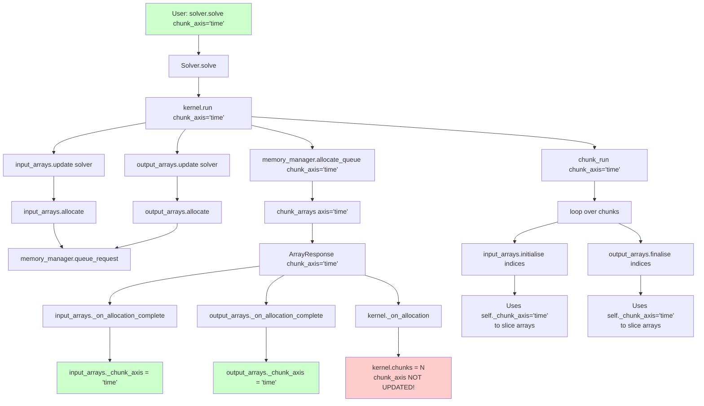
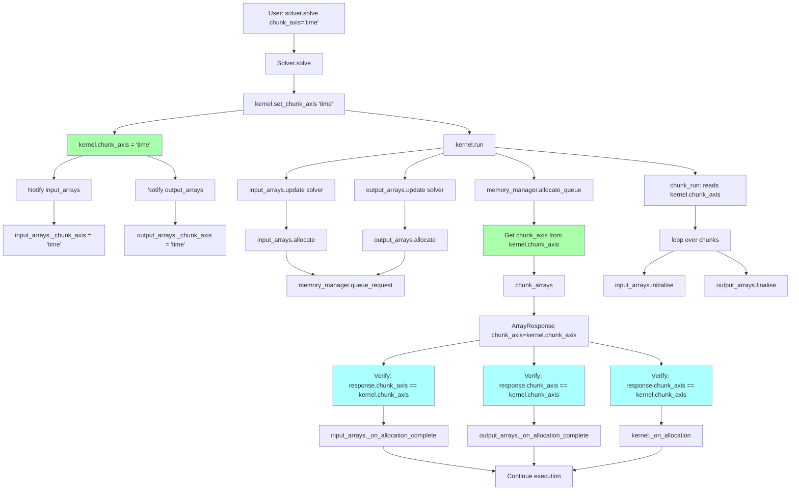

# Analysis: chunk_axis Parameter Flow in CuBIE

## Executive Summary

This document provides a comprehensive analysis of the `chunk_axis` parameter in CuBIE's batch solving system. The parameter controls which dimension (run, time, or variable) is used to partition workloads when GPU memory is insufficient for the full batch.

**Key Findings:**
- The parameter flows through 7 main classes: Solver, BatchSolverKernel, BaseArrayManager, BatchInputArrays, BatchOutputArrays, MemoryManager, and ArrayResponse
- Current implementation has **no single point of truth** - the value is copied and passed multiple times
- The parameter is set once in `Solver.solve()` but updated independently in each component
- Memory consistency is maintained through callback hooks but the flow is complex

---

## 1. Entry Points

### 1.1 User-Facing Entry Points

The `chunk_axis` parameter has two primary entry points:

1. **`Solver.solve()` method** (solver.py:339)
   - Default value: `"run"`
   - User-provided parameter via the `solve()` method
   - Example: `solver.solve(y0, params, chunk_axis="time")`

2. **`solve_ivp()` function** (solver.py:46)
   - Indirect entry: does not expose `chunk_axis` directly
   - Uses default value from `Solver.solve()`
   - Could be passed via `**kwargs`

### 1.2 Internal Defaults

Each class that stores `chunk_axis` has its own default:

| Class | Default Value | Location |
|-------|---------------|----------|
| BatchSolverKernel | `"run"` | BatchSolverKernel.py:150 |
| BaseArrayManager | `"run"` | BaseArrayManager.py:217 |
| ArrayResponse | `"run"` | array_requests.py:128 |

---

## 2. Parameter Ownership and Storage

### 2.1 Direct Owners (Store the Parameter)

The following classes maintain their own copy of `chunk_axis`:

| Class | Attribute Name | Type | Default | Mutable |
|-------|---------------|------|---------|---------|
| BatchSolverKernel | `chunk_axis` | str | `"run"` | Yes (public attribute) |
| BaseArrayManager | `_chunk_axis` | str | `"run"` | Yes (private attribute) |
| ArrayResponse | `chunk_axis` | str | `"run"` | No (frozen dataclass) |

**Important Notes:**
- BatchSolverKernel stores it as a **public instance attribute** (line 150)
- BaseArrayManager stores it as a **private instance attribute** (line 216)
- ArrayResponse receives it from MemoryManager allocation and stores immutably

### 2.2 Indirect Access (Property-Based)

| Class | Access Method | Source |
|-------|--------------|---------|
| Solver | `@property chunk_axis` | Returns `self.kernel.chunk_axis` |
| BatchInputArrays | Inherits from BaseArrayManager | Uses `self._chunk_axis` |
| BatchOutputArrays | Inherits from BaseArrayManager | Uses `self._chunk_axis` |

---

## 3. Parameter Flow and Updates

### 3.1 When and Where chunk_axis is Set

#### Initial Setting
1. **BatchSolverKernel.__init__()** (line 150)
   ```python
   self.chunk_axis = "run"  # Hard-coded default
   ```

2. **BaseArrayManager.__init__()** (via attrs field default, line 217)
   ```python
   _chunk_axis: str = field(default="run", ...)
   ```

#### Runtime Updates

**Update Path 1: Direct Assignment in BatchSolverKernel.run()**
- Location: BatchSolverKernel.py:433
- Method: `self.memory_manager.allocate_queue(self, chunk_axis=chunk_axis)`
- Source: Argument passed to `BatchSolverKernel.run()`

**Update Path 2: Callback Hook in BaseArrayManager._on_allocation_complete()**
- Location: BaseArrayManager.py:315
- Method: `self._chunk_axis = response.chunk_axis`
- Source: ArrayResponse from MemoryManager
- Trigger: After memory allocation completes

**Update Path 3: Direct Update in InputArrays.update_from_solver()**
- Location: BatchInputArrays.py:292
- Method: `self._chunk_axis = solver_instance.chunk_axis`
- Source: BatchSolverKernel.chunk_axis attribute

### 3.2 Where chunk_axis is Used (Read)

#### In MemoryManager
- **allocate_queue()** (mem_manager.py:1243-1322)
  - Used to chunk array requests along specified axis
  - Passed to `chunk_arrays()` method
  - Stored in ArrayResponse returned to instances

- **single_request()** (mem_manager.py:1186-1237)
  - Used to chunk arrays for single instance allocations
  - Stored in ArrayResponse

- **chunk_arrays()** (mem_manager.py:1138-1184)
  - Core chunking logic
  - Finds axis index in stride_order
  - Divides array shapes along that dimension

#### In BaseArrayManager Subclasses

**BatchInputArrays.initialise()** (BatchInputArrays.py:339-390)
- Uses `self._chunk_axis` to determine which dimension to slice
- Creates slices for host-to-device transfer

**BatchOutputArrays.finalise()** (BatchOutputArrays.py:336-384)
- Uses `self._chunk_axis` to determine which dimension to slice  
- Creates slices for device-to-host transfer

**BaseArrayManager.check_sizes()** (BaseArrayManager.py:491-591)
- Uses `self._chunk_axis` (local name: `chunk_axis_name`)
- Adjusts expected array shapes based on chunking

#### In BatchSolverKernel

**chunk_run()** (BatchSolverKernel.py:603-653)
- Uses `chunk_axis` parameter (passed as argument)
- Determines chunk size and duration based on axis
- Returns ChunkParams with per-chunk specifications

---

## 4. Argument Passing Chains

### 4.1 From User to MemoryManager

```
User Code
  ↓ (chunk_axis="time")
Solver.solve(chunk_axis="time")
  ↓
BatchSolverKernel.run(chunk_axis="time")
  ↓ (stored as argument, NOT on instance yet)
kernel.memory_manager.allocate_queue(self, chunk_axis="time")
  ↓
MemoryManager.allocate_queue(triggering_instance, chunk_axis="time")
  ↓
MemoryManager.chunk_arrays(requests, numchunks, axis="time")
  ↓
ArrayResponse(arr=..., chunks=N, chunk_axis="time")
```

### 4.2 From MemoryManager Back to Components

```
MemoryManager.allocate_queue()
  ↓ Creates ArrayResponse(chunk_axis="time")
  ↓
instance.allocation_ready_hook(response)
  ↓
BaseArrayManager._on_allocation_complete(response)
  ↓
self._chunk_axis = response.chunk_axis  # UPDATE
  ↓
BatchSolverKernel._on_allocation(response)
  ↓
self.chunks = response.chunks  # Updates chunks but NOT chunk_axis!
```

**CRITICAL OBSERVATION:** BatchSolverKernel does NOT update its `chunk_axis` 
attribute in the allocation callback, creating a potential inconsistency!

### 4.3 From BatchSolverKernel to Array Managers

```
InputArrays.update_from_solver(solver_instance)
  ↓
self._chunk_axis = solver_instance.chunk_axis  # Direct read
```

---

## 5. Temporal Analysis: When Copies are Updated

### 5.1 Timeline During solver.solve()

| Time | Event | chunk_axis Value | Location |
|------|-------|------------------|----------|
| T0 | `solver.solve(chunk_axis="time")` called | User provides "time" | Argument |
| T1 | `kernel.run(chunk_axis="time")` called | "time" | Argument |
| T2 | `input_arrays.update()` called | **"run"** (still default!) | InputArrays._chunk_axis |
| T3 | `output_arrays.update()` called | **"run"** (still default!) | OutputArrays._chunk_axis |
| T4 | Arrays call `.allocate()` | Queues requests | - |
| T5 | `memory_manager.allocate_queue(chunk_axis="time")` | "time" | Argument |
| T6 | MemoryManager chunks arrays along "time" | "time" | Processing |
| T7 | ArrayResponse created | "time" | ArrayResponse.chunk_axis |
| T8 | `_on_allocation_complete()` callbacks | **"time"** | InputArrays._chunk_axis updated |
| T9 | `_on_allocation_complete()` callbacks | **"time"** | OutputArrays._chunk_axis updated |
| T10 | BatchSolverKernel callback | **"run"** (NOT UPDATED!) | kernel.chunk_axis |
| T11 | Chunks processed in kernel loop | "time" used for slicing | Via updated array managers |

### 5.2 Dead Ends and Inconsistencies

**Dead End 1: BatchSolverKernel.chunk_axis Never Updated**
- Initial value: `"run"` (line 150)
- User provides: `"time"` to solve()
- After allocation: Still `"run"`
- **Why this works:** The value is not read after being passed to MemoryManager
- **Risk:** If accessed via `Solver.chunk_axis` property, returns stale value

**Dead End 2: Array Managers Before Allocation**
- From T2-T7, array managers have wrong value (`"run"` instead of `"time"`)
- Only corrected after allocation callback (T8-T9)
- **Why this works:** Value not used until `initialise()`/`finalise()` calls
- **Risk:** If array methods are called before allocation completes, wrong axis used

---

## 6. Diagrams

### Diagram 1: Full Parameter Flow Through solver.solve()



**Legend:**
- Green boxes: Correct values
- Red boxes: Potential inconsistency (not updated but not used)
- White boxes: Intermediate steps

---

### Diagram 2: Ownership, Lifecycle, and Access Patterns

```mermaid
graph TB
    subgraph "Solver (No Storage)"
        S1[solve method<br/>receives chunk_axis]
        S2[@property chunk_axis<br/>returns kernel.chunk_axis]
    end
    
    subgraph "BatchSolverKernel (Owner 1)"
        K1[__init__<br/>SET: self.chunk_axis = 'run']
        K2[run method<br/>READ: Never accessed<br/>PASS: to allocate_queue]
        K3[_on_allocation<br/>NOT UPDATED]
        K1 --> K2
        K2 -.-> K3
    end
    
    subgraph "InputArrays (Owner 2)"
        I1[__init__ via BaseArrayManager<br/>SET: self._chunk_axis = 'run']
        I2[update_from_solver<br/>SET: self._chunk_axis = solver.chunk_axis]
        I3[_on_allocation_complete<br/>SET: self._chunk_axis = response.chunk_axis]
        I4[initialise<br/>READ: self._chunk_axis]
        I1 --> I2
        I2 --> I3
        I3 --> I4
    end
    
    subgraph "OutputArrays (Owner 3)"
        O1[__init__ via BaseArrayManager<br/>SET: self._chunk_axis = 'run']
        O2[_on_allocation_complete<br/>SET: self._chunk_axis = response.chunk_axis]
        O3[finalise<br/>READ: self._chunk_axis]
        O1 --> O2
        O2 --> O3
    end
    
    subgraph "MemoryManager (Passes Through)"
        M1[allocate_queue<br/>RECEIVE: chunk_axis param]
        M2[chunk_arrays<br/>RECEIVE: axis param<br/>USE: for chunking logic]
        M3[CREATE: ArrayResponse<br/>SET: chunk_axis field]
        M1 --> M2
        M2 --> M3
    end
    
    subgraph "ArrayResponse (Owner 4)"
        R1[Immutable Storage<br/>chunk_axis: str]
    end
    
    S1 --> K2
    K2 --> M1
    M3 --> I3
    M3 --> O2
    M3 --> K3
    M3 --> R1
    
    I2 -.->|Reads stale value| K2
    S2 -.->|Returns stale value| K2
    
    style K3 fill:#ffcccc
    style K2 fill:#ffffcc
    style I2 fill:#ffffcc
    style S2 fill:#ffcccc
```

**Legend:**
- Yellow boxes: Reading potentially stale values
- Red boxes: Never updated (but harmless in current code)
- Blue subgraphs: Storage owners
- Green subgraphs: Pass-through only

**Access Pattern Summary:**

| Phase | Operation | chunk_axis Value | Source |
|-------|-----------|------------------|--------|
| Construction | All components initialized | `"run"` | Hard-coded defaults |
| Before solve() | User sets parameter | User-provided | Argument to solve() |
| Early solve() | Passed to kernel.run() | User-provided | Argument |
| Array update | Arrays read from kernel | `"run"` (stale!) | kernel.chunk_axis |
| Allocation | MemoryManager processes | User-provided | Argument to allocate_queue |
| Post-allocation | Arrays updated from response | User-provided | response.chunk_axis |
| Chunk loop | Arrays use for slicing | User-provided | self._chunk_axis |

---

### Diagram 3: Proposed Improvement (Single Point of Truth)



**Proposed Changes:**

1. **Single Source of Truth:** `BatchSolverKernel.chunk_axis`
   - Set once before allocation via dedicated setter method
   - All other components read from kernel

2. **Eliminate Redundant Storage:**
   - Remove `BaseArrayManager._chunk_axis` 
   - Replace with property: `return self._memory_manager.get_registered_kernel(self).chunk_axis`
   - Or pass as argument to methods that need it

3. **Verify Consistency:**
   - MemoryManager reads from kernel instead of receiving as parameter
   - ArrayResponse still stores value for validation
   - Allocation callbacks verify response matches kernel

4. **Update Flow:**
   ```python
   # Current (multiple sources)
   kernel.run(chunk_axis="time")  # Parameter
   memory_manager.allocate_queue(chunk_axis="time")  # Re-passed
   
   # Proposed (single source)
   kernel.chunk_axis = "time"  # Set once
   kernel.run()  # No parameter needed
   memory_manager.allocate_queue()  # Reads from kernel
   ```

**Benefits:**
- Eliminates stale value risks
- Clearer ownership model
- Easier to debug and test
- Fewer parameters to pass around
- ArrayResponse becomes validation only

**Risks:**
- Requires kernel reference in MemoryManager or BaseArrayManager
- More coupling between components
- May need backward compatibility for current API

---

## 7. Summary and Recommendations

### 7.1 Current State Assessment

**What Works:**
- Despite multiple copies and update points, the system functions correctly
- The value reaches the right places at the right times
- Callbacks ensure eventual consistency

**What's Problematic:**
- No single point of truth - 4 different storage locations
- BatchSolverKernel.chunk_axis never updated after construction
- Array managers have wrong value during initial update phase
- `Solver.chunk_axis` property returns stale value
- Complex temporal dependencies on callback execution order

### 7.2 Recommendations

#### Immediate (Low Risk)
1. **Document the current behavior** - This report serves that purpose
2. **Add tests** verifying chunk_axis flows correctly through all paths
3. **Update BatchSolverKernel._on_allocation** to set `self.chunk_axis = response.chunk_axis`

#### Short Term (Medium Risk)
1. **Add validation** in allocation callbacks to warn if values mismatch
2. **Add property getters** in BaseArrayManager to make the source explicit
3. **Consider deprecating** direct access to kernel.chunk_axis

#### Long Term (Higher Risk, Better Design)
1. **Implement single source of truth** as shown in Diagram 3
2. **Remove redundant storage** from BaseArrayManager
3. **Change API** to set chunk_axis before run() via setter method
4. **Simplify parameter passing** - eliminate chunk_axis arguments

### 7.3 Testing Recommendations

Add tests that verify:
1. `chunk_axis` flows correctly through Solver → Kernel → MemoryManager
2. Array managers receive correct value via callback
3. Chunking works correctly for "run", "time", and "variable" axes
4. `Solver.chunk_axis` property returns current (not stale) value
5. Changing chunk_axis between solve() calls works correctly

### 7.4 Code Locations Reference

For future maintenance, here are the key locations:

| Operation | File | Line(s) |
|-----------|------|---------|
| Initial default | BatchSolverKernel.py | 150 |
| User entry point | solver.py | 339 |
| Passed to MemoryManager | BatchSolverKernel.py | 433 |
| Array update from kernel | BatchInputArrays.py | 292 |
| Callback update | BaseArrayManager.py | 315 |
| Chunking logic | mem_manager.py | 1138-1184 |
| Array slicing (input) | BatchInputArrays.py | 375-381 |
| Array slicing (output) | BatchOutputArrays.py | 365-369 |

---

## Appendix A: Parameter Validator

The `chunk_axis` parameter is validated in several places:

1. **BaseArrayManager.__init__** (BaseArrayManager.py:217)
   ```python
   _chunk_axis: str = field(
       default="run", 
       validator=attrsval_in(["run", "variable", "time"])
   )
   ```

2. **ArrayResponse.__init__** (array_requests.py:128)
   ```python
   chunk_axis: str = attrs.field(
       default="run", 
       validator=val.in_(["run", "variable", "time"])
   )
   ```

3. **No validation** in BatchSolverKernel or Solver.solve()
   - Risk: Invalid values could be passed to MemoryManager
   - Recommendation: Add validation at user entry point

## Appendix B: Relationship to ManagedArray

The `ManagedArray` class (BaseArrayManager.py:39-88) stores:
- `is_chunked`: Whether the array can be chunked (default: True)
- `stride_order`: Tuple like `("time", "variable", "run")`

The `chunk_axis` parameter must match one of the labels in `stride_order`:
- Arrays with `chunk_axis` not in their `stride_order` are not chunked
- Arrays with `is_chunked=False` are not chunked even if axis matches
- This is enforced in `MemoryManager.chunk_arrays()` (lines 1174-1175)

Example from status_codes array (BatchOutputArrays.py:67-73):
```python
status_codes: ManagedArray = field(
    factory=lambda: ManagedArray(
        dtype=np_int32,
        stride_order=("run",),  # Only 1D
        shape=(1,),
        is_chunked=False,  # Never chunk status codes
    )
)
```

This array is not chunked even when `chunk_axis="run"` because `is_chunked=False`.

---

## Appendix C: Glossary

- **chunk_axis**: The dimension along which arrays are divided when memory is limited
- **chunking**: Dividing a large allocation into smaller pieces that fit in available memory
- **stride_order**: The ordering of logical dimensions (time, variable, run) in memory layout
- **allocation callback**: Hook function called when memory allocation completes
- **single point of truth**: Design pattern where a value is stored in exactly one place
- **stale value**: An outdated copy of data that hasn't been updated

