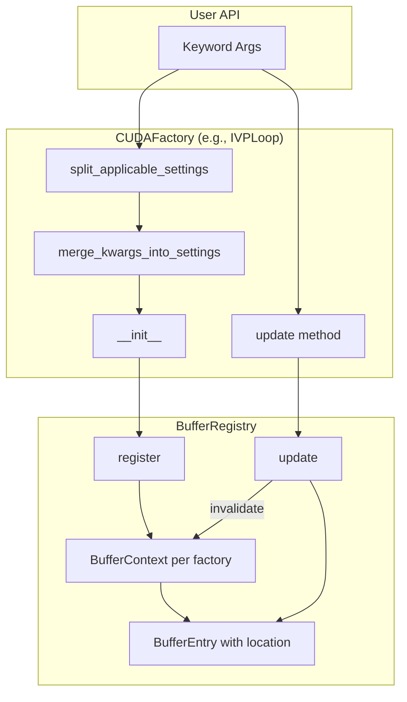
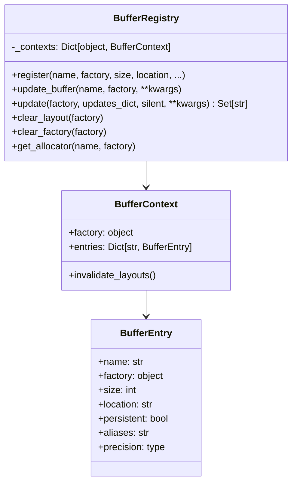
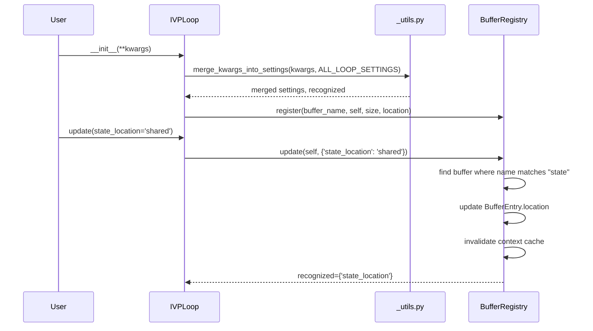

# Buffer Settings Plumbing - Architectural Plan

## User Stories

### US-1: Unified Buffer Location Management
**As a** CuBIE developer  
**I want** buffer location parameters (`*_location` kwargs) to be treated identically to other compile settings like `dt_save`  
**So that** there is a single, consistent pattern for ownership, initialization, and update of all compile-critical parameters

**Acceptance Criteria:**
- Buffer location kwargs are merged into each factory's existing argument list using `split_applicable_settings()` and `merge_kwargs_into_settings()`
- No separate buffer-location keyword argument dictionaries exist
- No `if state_location is not None:` conditional noise in `__init__` methods
- Buffer locations follow the same code path as other compile settings

### US-2: Factory-Owned Buffer Locations
**As a** CuBIE developer  
**I want** each CUDAFactory to own its buffers and their locations  
**So that** buffer location information is co-located with the factory that uses it, and the registry holds per-factory information

**Acceptance Criteria:**
- Each CUDAFactory that registers buffers owns the location metadata for those buffers
- Only loop-assigned buffers are declared as keyword args for `IVPLoop`
- Buffer location is stored in `BufferEntry` (already present) and updated via factory methods
- Registry reflects per-factory buffer ownership

### US-3: Registry Update Pattern for Buffer Locations
**As a** CuBIE developer  
**I want** `BufferRegistry` to have an `update()` method that follows the same pattern as `update_compile_settings()`  
**So that** buffer location updates use a consistent, discoverable API

**Acceptance Criteria:**
- `BufferRegistry.update()` method exists with signature matching `update_compile_settings()` pattern
- Method finds `CUDABuffer` objects where keyword matches `[buffer_name]_location` pattern
- Method updates the buffer's location property
- Method invalidates that context's cache
- Method returns the keyword as recognized (set of recognized keys)
- Implementation follows existing `update()` and `update_compile_settings()` patterns exactly

---

## Overview

This document describes the architectural changes required to treat buffer location parameters as first-class compile settings, following the same patterns used for other compile-critical parameters like `dt_save`.

### Core Principle

**Buffer location parameters are NOT a separate thing from other compile settings.** They must follow identical patterns for:
- Ownership: Each CUDAFactory owns its buffers and their locations
- Initialization: Use existing `split_applicable_settings()` and `merge_kwargs_into_settings()` utilities
- Update: New `BufferRegistry.update()` method mirrors `update_compile_settings()` behavior

---

## Data Flow Diagram

---

## Component Architecture

### 1. BufferRegistry Enhancement

The `BufferRegistry` class receives a new `update()` method that follows the exact pattern of `CUDAFactory.update_compile_settings()`:

### 2. IVPLoop Changes

`IVPLoop` continues to accept buffer location parameters as keyword arguments, but:

1. **Uses existing utilities**: Location kwargs are merged using `merge_kwargs_into_settings()` rather than special-case handling
2. **No conditional noise**: No `if state_location is not None:` patterns
3. **Unified update path**: The `update()` method delegates buffer location updates to `BufferRegistry.update()`

---

## Expected Behavior

### BufferRegistry.update() Method

The new `update()` method follows the exact pattern of `CUDAFactory.update_compile_settings()`:

**Inputs:**
- `factory`: The CUDAFactory instance whose buffers should be updated
- `updates_dict`: Optional dictionary of parameter updates
- `silent`: When True, suppress errors for unrecognized parameters
- `**kwargs`: Additional parameter updates

**Behavior:**
1. Merge `updates_dict` and `kwargs`
2. For each key-value pair:
   - Check if key matches pattern `{buffer_name}_location`
   - If match found in factory's registered buffers:
     - Update `BufferEntry.location` to the new value
     - Mark key as recognized
     - Invalidate the context's cached layouts
3. Return set of recognized parameter names

**Return:**
- `Set[str]`: Names of parameters that were recognized and updated

**Error Handling:**
- If `silent=False` and unrecognized parameters exist, raise `KeyError`
- Follow exact error message format from `update_compile_settings()`

### IVPLoop.update() Integration

The existing `IVPLoop.update()` method is enhanced to:

1. Call `buffer_registry.update(self, updates_dict, silent=True)` first
2. Merge the recognized set from registry with compile settings updates
3. Report all recognized parameters consistently

---

## Architectural Decisions

### Decision 1: No Separate Location Dict

**Decision:** Buffer location kwargs are merged directly into the factory's existing argument handling, not into a separate dictionary.

**Rationale:** Matches the overall principle that buffer locations are identical to other compile settings. Reduces code complexity and eliminates special-case handling.

### Decision 2: Registry Owns Update Logic

**Decision:** The `BufferRegistry.update()` method contains the logic to map `*_location` parameters to buffer entries.

**Rationale:** The registry already knows about all registered buffers and their names. Centralizing the mapping logic in the registry prevents duplication across factories.

### Decision 3: Pattern Matching via Name Suffix

**Decision:** Buffer location parameters are identified by matching `{buffer_name}_location` patterns where `buffer_name` is the registered buffer name (e.g., `loop_state` → `loop_state_location`).

**Rationale:** Consistent, predictable naming convention that doesn't require additional metadata or mappings.

### Decision 4: Context Cache Invalidation on Update

**Decision:** When a buffer location is updated, the affected context's layouts are invalidated immediately.

**Rationale:** Matches existing cache invalidation patterns in CUDAFactory. Ensures that subsequent `get_allocator()` calls return freshly computed allocators reflecting the new location.

---

## Integration Points

### With CUDAFactory Base Class
- `BufferRegistry.update()` mirrors `CUDAFactory.update_compile_settings()` signature and behavior
- Factories can delegate location updates to registry then merge recognized sets

### With _utils.py
- Continue using `split_applicable_settings()` for filtering applicable kwargs
- Continue using `merge_kwargs_into_settings()` for combining settings
- No new utility functions required

### With Existing Buffer Registration
- `BufferEntry` already has `location` field - no schema changes needed
- `update_buffer()` method already exists - `update()` is a higher-level wrapper
- `invalidate_layouts()` already exists on `BufferContext`

---

## Edge Cases

### Case 1: Unknown Location Parameter
When `update()` receives a key like `unknown_buffer_location`, the key is not recognized because no buffer named `unknown_buffer` is registered. If `silent=False`, raise `KeyError`.

### Case 2: Non-Location Parameters
Parameters that don't end in `_location` are not handled by `BufferRegistry.update()`. They pass through as unrecognized and the calling factory handles them via `update_compile_settings()`.

### Case 3: Multiple Buffers Updated
When updating multiple buffer locations in one call (e.g., `update(state_location='shared', parameters_location='local')`), all recognized updates are applied atomically, then the context is invalidated once.

### Case 4: Invalid Location Value
If the new location value is not in `['shared', 'local']`, the `BufferEntry` validator raises `ValueError`. This matches existing registration behavior.

---

## Summary

This architectural plan ensures that buffer location parameters:
1. Are owned by each CUDAFactory that registers buffers
2. Use existing argument merging utilities (no special-case dicts)
3. Follow update patterns identical to `update_compile_settings()`
4. Have a consistent, discoverable API via `BufferRegistry.update()`

The implementation maintains CuBIE's existing patterns while eliminating the conceptual separation between buffer locations and other compile settings.
